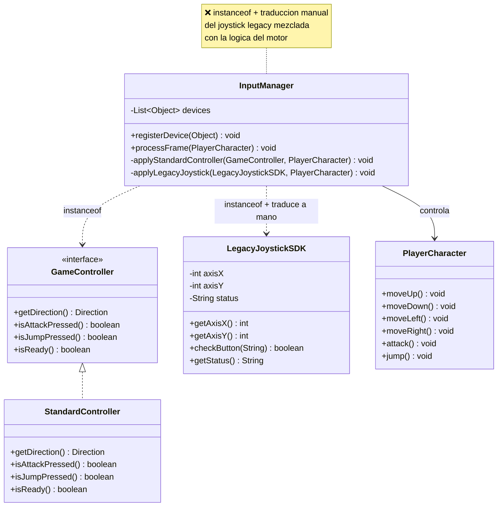
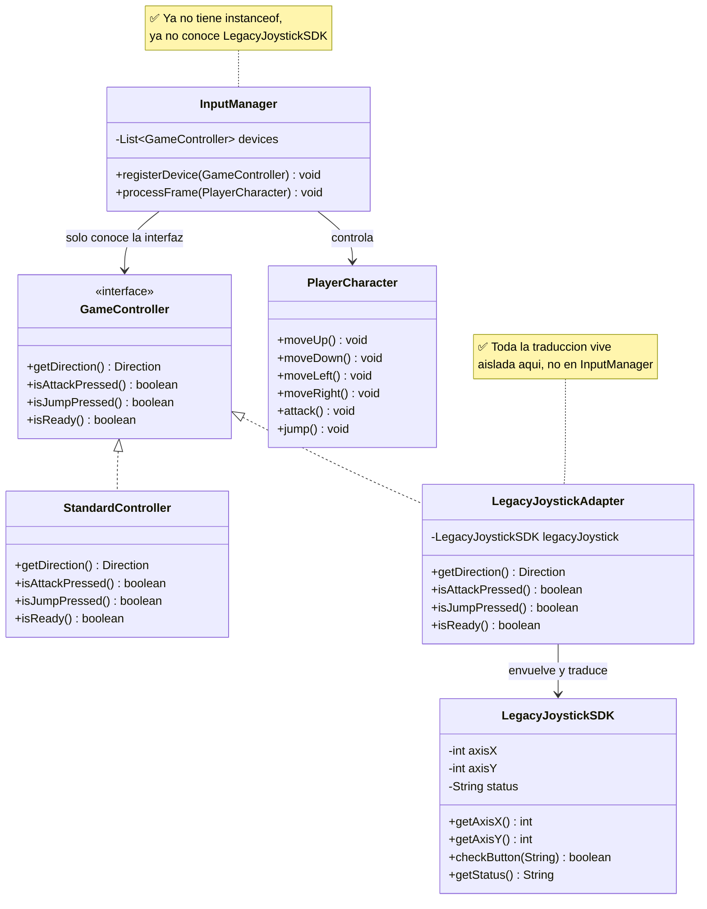

# Ejercicio 1: Patrones Estructurales — Ejercicio Adapter

---

## Caso de Estudio: Sistema de Entrada de un Videojuego Arcade

Un estudio de videojuegos desarrolla un motor 2D sencillo. El motor procesa,
en cada frame, las ordenes que llegan desde el dispositivo de entrada del
jugador (mover, atacar, saltar) y se las aplica a `PlayerCharacter`.

Desde el inicio, el motor fue disenado para trabajar contra una interfaz
propia, `GameController`. El control moderno del estudio (`StandardController`)
ya la implementa sin problemas.

El problema aparece cuando el estudio decide dar soporte a un **joystick
retro de un fabricante externo** (`LegacyJoystickSDK`). Es una libreria de
terceros: no se puede modificar y su forma de representar la entrada es
totalmente distinta (ejes numericos en vez de `Direction`, botones
identificados por `String`, estado de conexion como texto en vez de
`boolean`).

Para "salir del paso", alguien del equipo agrego un `instanceof` dentro de
`InputManager.processFrame(...)` que detecta cuando el dispositivo es un
`LegacyJoystickSDK` y traduce sus datos ahi mismo, en linea, cada vez que se
procesa un frame.

Esto ya esta implementado y **funciona** (puedes correrlo), pero tiene
varios problemas de diseno que debes resolver aplicando el **patron
Adapter**.

---

## Preparacion del Proyecto

El proyecto Maven ya esta creado en este directorio (`L03/`), con el
siguiente paquete:

- `com.ulima.is2.l03.ejercicio01` — Adapter

Clases ya implementadas (no deberias necesitar tocarlas, salvo
`InputManager`, que es justamente el codigo a mejorar):

| Clase | Rol en el patron | Descripcion |
| --- | --- | --- |
| `GameController` | Target | Interfaz que espera el motor del juego. |
| `StandardController` | Adaptee compatible | Control moderno, ya implementa `GameController`. |
| `LegacyJoystickSDK` | Adaptee incompatible | Joystick retro de terceros. **No modificar.** |
| `RetroGamepadDriver` | Adaptee incompatible (reto extra) | Segundo dispositivo de terceros, aun no integrado. **No modificar.** |
| `PlayerCharacter` | Receptor | Personaje que ejecuta las ordenes. |
| `InputManager` | Client | Orquesta el frame. **Contiene el codigo problematico.** |
| `Main` | Demo | Simula un par de frames por consola. |

### Como correr el proyecto

```bash
mvn test              # compila y corre las pruebas
mvn compile exec:java # corre la demo (Main)
```

---

## 1) Diagrama del Codigo Actual (Problematico)



**Por que es problematico:**

- **Viola OCP:** si manana llega `RetroGamepadDriver`, hay que volver a
  modificar `InputManager.processFrame(...)` agregando otra rama `else if`.
- **Viola DRY:** la logica de traduccion de ejes/botones del joystick vive
  mezclada con el bucle de juego, en vez de estar aislada en un solo lugar.
- **Acoplamiento indebido:** `InputManager` conoce detalles internos de
  `LegacyJoystickSDK` (nombres de botones como `"FIRE"`, convencion de ejes)
  que no le incumben.
- `devices` es `List<Object>`: se perdio el tipado fuerte que dan las
  interfaces.

---

## 2) Diagrama de la Solucion (Adapter)



#### **Implementa la solucion creando:**

- `LegacyJoystickAdapter implements GameController`, que recibe un
  `LegacyJoystickSDK` en el constructor y traduce cada metodo:
  - `getDirection()` a partir de `getAxisX()` / `getAxisY()` (prioriza el
    eje Y, igual que el codigo actual).
  - `isAttackPressed()` a partir de `checkButton("FIRE")`.
  - `isJumpPressed()` a partir de `checkButton("JUMP")`.
  - `isReady()` a partir de `getStatus().equals("OK")`.
- Refactoriza `InputManager` para que:
  - `devices` sea `List<GameController>` (ya no `List<Object>`).
  - `registerDevice(...)` reciba un `GameController`.
  - `processFrame(...)` **ya no tenga ningun `instanceof`** ni conozca a
    `LegacyJoystickSDK`: debe tratar todos los dispositivos de manera
    polimorfica.
- Actualiza `Main` para registrar el joystick legacy envuelto en tu
  adapter: `inputManager.registerDevice(new LegacyJoystickAdapter(retroJoystick))`.

### Reto de extensibilidad (opcional)

En el proyecto ya existe `RetroGamepadDriver`, un segundo dispositivo de
terceros que representa la direccion en coordenadas **polares** (angulo en
grados + magnitud) en vez de ejes. Todavia no esta integrado a nada.

Sin tocar `InputManager` ni `PlayerCharacter`, agrega soporte para este
dispositivo creando **unicamente** un `RetroGamepadAdapter implements
GameController`. Si tu refactor del punto anterior esta bien hecho, esto
deberia ser lo unico que necesitas escribir — eso es justamente lo que
demuestra que `InputManager` ahora cumple OCP.

Sugerencia de mapeo: considera que el stick esta "activo" en una direccion
si `magnitude > 0.5`; usa el `angleDegrees` (0° = derecha, 90° = arriba,
180° = izquierda, 270° = abajo) para decidir entre `UP`/`DOWN`/`LEFT`/`RIGHT`.

---

## Sobre las pruebas existentes

`InputManagerTest` ya contiene pruebas que describen el comportamiento que
debe conservarse (que accion dispara cada combinacion de entrada sobre
`PlayerCharacter`). Estan escritas contra la API **actual**
(`registerDevice(Object)`).

Cuando refactorices `registerDevice(...)` a que reciba `GameController`, la
linea que registra el `LegacyJoystickSDK` directamente dejara de compilar:
reemplazala por `registerDevice(new LegacyJoystickAdapter(joystick))`. Las
**aserciones** (el resultado esperado) no deberian cambiar — si cambian,
probablemente cambiaste el comportamiento, no solo la estructura.

Se espera que agregues tambien tus propias pruebas unitarias para
`LegacyJoystickAdapter` (y, si resuelves el reto extra, para
`RetroGamepadAdapter`).

---

## Entregables

1. `LegacyJoystickAdapter` implementado y usado desde `Main`.
2. `InputManager` refactorizado: sin `instanceof`, sin referencias a
   `LegacyJoystickSDK`, `devices` tipado como `List<GameController>`.
3. `InputManagerTest` actualizado y en verde (`mvn test`).
4. Pruebas unitarias propias para `LegacyJoystickAdapter`.
5. (Opcional) `RetroGamepadAdapter` para el reto de extensibilidad.

