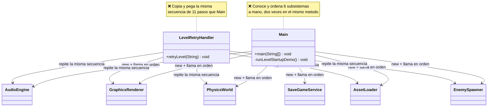
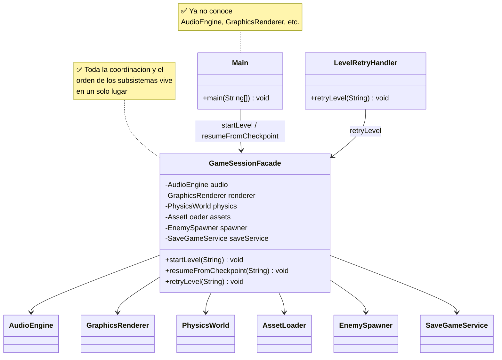
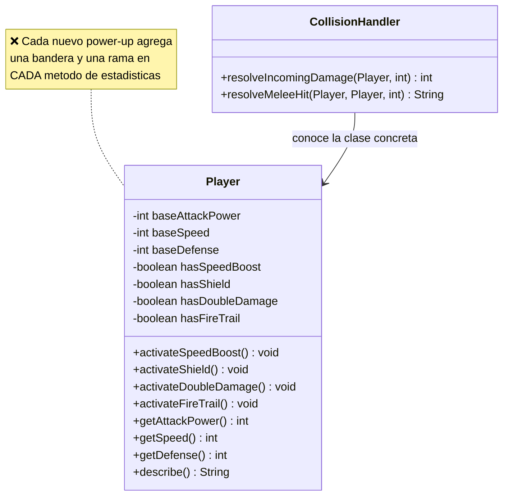
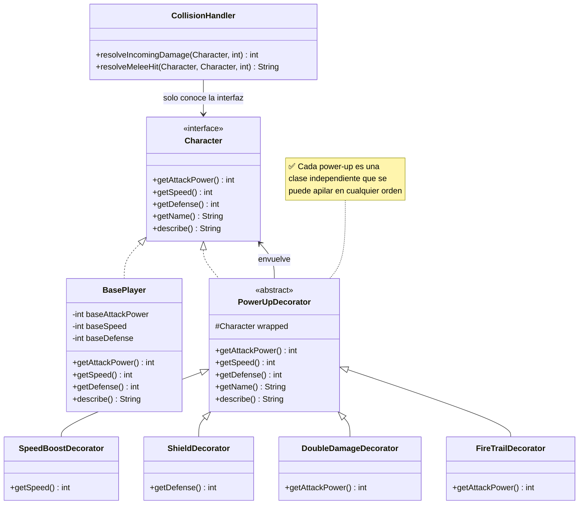

# Patrones Estructurales — Ejercicio Facade + Decorator

---

## Caso de Estudio: Motor 2D de un Videojuego

El mismo estudio de videojuegos del `L03-a` sigue desarrollando su motor 2D.
Ahora el equipo esta trabajando en dos frentes distintos, y en ambos "salio
del paso" copiando y pegando codigo en vez de disenar bien:

1. **Arrancar un nivel** requiere coordinar varios subsistemas (audio,
   graficos, fisica, carga de assets, spawn de enemigos, guardado) **en el
   orden correcto**. Esa secuencia esta duplicada, a mano, en al menos dos
   lugares del codigo.
2. **Los power-ups del jugador** (velocidad, escudo, daño doble, rastro de
   fuego) se representan como banderas booleanas dentro de `Player`, y cada
   metodo de estadisticas (`getAttackPower`, `getSpeed`, `getDefense`,
   `describe`) tiene que revisarlas todas.

Ambos problemas **ya estan implementados y funcionan** (puedes correrlos),
pero tienen defectos de diseno que debes resolver aplicando **Facade**
(para el arranque de niveles) y **Decorator** (para los power-ups).

---

## Preparacion del Proyecto

El proyecto Maven ya esta creado en este directorio (`L03-b/`), con el
siguiente paquete:

- `com.ulima.is2.l03.ejercicio02` — Facade + Decorator

### Como correr el proyecto

En caso que quieras correr el proyecto por shell:

```bash
mvn test              # compila y corre las pruebas
mvn compile exec:java # corre la demo (Main)
```

Si no puedes correrlo por los mecanismos del propio IDE (Netbeans, IntelliJ)

---

## Parte 1 — Facade: arranque de niveles

### Clases involucradas

| Clase | Rol | Descripcion |
| --- | --- | --- |
| `AudioEngine` | Subsistema | Inicializa audio, carga y reproduce pistas. |
| `GraphicsRenderer` | Subsistema | Crea el contexto grafico y carga texturas. |
| `PhysicsWorld` | Subsistema | Inicializa la fisica y sus colisionadores. |
| `AssetLoader` | Subsistema | Carga la definicion del nivel y sus sprites. |
| `EnemySpawner` | Subsistema | Genera y limpia oleadas de enemigos. |
| `SaveGameService` | Subsistema | Traduce un checkpoint al nivel que le corresponde. |
| `GameEventLog` | Colaborador | Bitacora compartida; permite verificar en pruebas el orden de llamadas. |
| `Main` | Client (problematico) | Arranca el nivel 1 y reanuda desde checkpoint, repitiendo la secuencia dos veces. |
| `LevelRetryHandler` | Client (problematico) | Repite la misma secuencia una tercera vez para el boton "Reintentar". |

### 1) Diagrama del Codigo Actual (Problematico)



**Por que es problematico:**

- **Viola DRY:** la secuencia "limpiar escena -> resetear fisica -> limpiar
  enemigos -> parar musica -> cargar assets -> cargar texturas -> cargar
  colisionadores -> cargar y reproducir pista -> spawnear oleada" esta
  copiada y pegada en `Main` (dos veces) y en `LevelRetryHandler` (una
  tercera vez).
- **Acoplamiento indebido:** cualquier clase que quiera iniciar o reanudar
  un nivel necesita conocer los **seis** subsistemas y, peor aun, el
  **orden exacto** en que hay que llamarlos. Si ese orden cambia (por
  ejemplo, cargar assets antes de resetear fisica), hay que corregirlo en
  cada copia.
- **Alta complejidad para el cliente:** `Main` y `LevelRetryHandler`
  deberian preocuparse por *que* nivel iniciar, no por *como* se coordinan
  internamente sus subsistemas.

### 2) Diagrama de la Solucion (Facade)



#### **Implementa la solucion creando:**

- `GameSessionFacade`, que recibe (o crea) los seis subsistemas y expone:
  - `startLevel(String levelId)`: inicializa graficos/audio/fisica **una
    sola vez** y luego corre la secuencia comun de carga sobre `levelId`.
  - `resumeFromCheckpoint(String checkpointId)`: resuelve el nivel con
    `SaveGameService.loadCheckpoint(...)` y corre la secuencia comun sobre
    ese nivel.
  - `retryLevel(String levelId)`: corre la secuencia comun directamente
    sobre `levelId`.
  - La "secuencia comun" (limpiar escena, resetear fisica, limpiar
    enemigos, parar musica, cargar assets, texturas, colisionadores,
    pista, y spawnear la oleada) debe existir **una sola vez**, en un
    metodo privado del Facade.
- Refactoriza `Main` para que solo use `GameSessionFacade` (ya no debe
  instanciar `AudioEngine`, `GraphicsRenderer`, etc. directamente).
- Refactoriza `LevelRetryHandler` para que reciba o use un
  `GameSessionFacade` en vez de sus propias instancias de subsistemas.

---

## Parte 2 — Decorator: power-ups del jugador

### Clases involucradas

| Clase | Rol | Descripcion |
| --- | --- | --- |
| `Player` | Componente (problematico) | Guarda banderas booleanas por cada power-up activo. |
| `CollisionHandler` | Client | Calcula dano usando `getAttackPower()` / `getDefense()` de `Player`. |
| `Main` | Demo | Activa power-ups sobre dos jugadores y simula un golpe. |

### 1) Diagrama del Codigo Actual (Problematico)



**Por que es problematico:**

- **Viola OCP:** agregar un power-up nuevo (por ejemplo, `Invisibilidad` o
  `Veneno`) obliga a modificar `Player` y tocar `getAttackPower()`,
  `getSpeed()`, `getDefense()` **y** `describe()`.
- **No soporta combinaciones dinamicas ni acumulables:** un power-up es
  una bandera booleana, asi que no se puede representar "dos cargas de
  Speed Boost" ni aplicar el mismo power-up dos veces con efectos
  independientes.
- **Rigidez:** el orden en que se "activan" los power-ups no importa hoy
  (son banderas), pero en un diseno correcto con efectos que se combinan
  (por ejemplo, multiplicar vs. sumar) el orden de aplicacion si deberia
  poder decidirse en tiempo de ejecucion.
- `CollisionHandler` depende de la clase concreta `Player`: no puede
  combatir contra ningun otro tipo de personaje aunque tenga las mismas
  estadisticas.

### 2) Diagrama de la Solucion (Decorator)



#### **Implementa la solucion creando:**

- `Character`, interfaz con `getAttackPower()`, `getSpeed()`,
  `getDefense()`, `getName()` y `describe()`.
- `BasePlayer implements Character`, con la misma logica que hoy tiene
  `Player` pero **sin ninguna bandera de power-up**.
- `PowerUpDecorator implements Character` (abstracta), que guarda un
  `Character wrapped` y delega por defecto los cinco metodos a `wrapped`.
- Cuatro decoradores concretos, cada uno sobrescribiendo **solo** el
  metodo que le corresponde:
  - `SpeedBoostDecorator`: `getSpeed()` retorna `wrapped.getSpeed() + 4`.
  - `ShieldDecorator`: `getDefense()` retorna `wrapped.getDefense() + 10`.
  - `DoubleDamageDecorator`: `getAttackPower()` retorna
    `wrapped.getAttackPower() * 2`.
  - `FireTrailDecorator`: `getAttackPower()` retorna
    `wrapped.getAttackPower() + 5`.
- Actualiza `CollisionHandler` para que reciba `Character` en vez de
  `Player` (ya no depende de la clase concreta).
- Actualiza `Main` para armar, por ejemplo, un jugador con dano doble y
  rastro de fuego asi:
  `Character hero = new FireTrailDecorator(new DoubleDamageDecorator(new BasePlayer("Hero", 10, 5, 2)));`

**Nota sobre el orden de los decoradores:** con las formulas de arriba,
envolver primero `DoubleDamageDecorator` y luego `FireTrailDecorator` da
`(10*2)+5=25`, pero al reves da `(10+5)*2=30`. Ese comportamiento es
correcto y esperado — es justamente lo que gana el diseño con Decorator:
el orden de aplicacion ahora se decide en tiempo de ejecucion, algo que
las banderas booleanas de `Player` no permitian expresar.

---

## Sobre las pruebas existentes

`PlayerPowerUpTest` y `LevelRetryHandlerTest` ya contienen pruebas que
describen el comportamiento que debe conservarse, escritas contra la API
**actual** (`Player` con banderas, `LevelRetryHandler` con subsistemas
propios).

- Cuando refactorices el power-up a `Character` + decoradores, las pruebas
  de `PlayerPowerUpTest` que usan `new Player(...)` y
  `activateXxx()` dejaran de compilar: reemplazalas por la composicion de
  decoradores equivalente (por ejemplo, `player.activateDoubleDamage()`
  se reemplaza por envolver con `new DoubleDamageDecorator(player)`). Los
  valores esperados (`assertEquals(20, ...)`, etc.) no deberian cambiar.
- Cuando muevas la orquestacion de subsistemas a `GameSessionFacade`,
  `LevelRetryHandlerTest` deberia poder actualizarse para invocar
  `facade.retryLevel("level-2")` en vez de construir un
  `LevelRetryHandler` con sus propios subsistemas — la lista de eventos
  esperada en `log.getEvents()` **no deberia cambiar**: eso es justamente
  lo que demuestra que el Facade preserva el comportamiento.

Se espera que agregues tambien tus propias pruebas unitarias para
`GameSessionFacade` (`startLevel`, `resumeFromCheckpoint`) y para al menos
dos de los decoradores (incluyendo un caso donde se apilen dos o mas
power-ups en distinto orden).

---

## Entregables

1. `GameSessionFacade` implementado y usado desde `Main` y
   `LevelRetryHandler`.
2. `Character`, `BasePlayer` y los cuatro decoradores de power-ups
   implementados y usados desde `Main`.
3. `CollisionHandler` refactorizado para depender de `Character`, no de
   `Player`.

